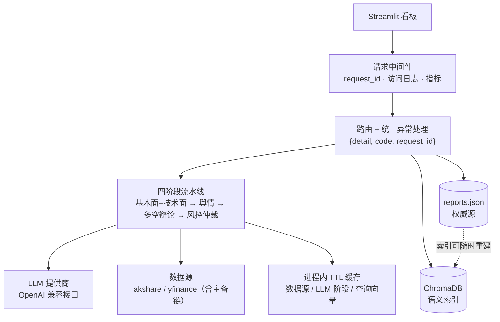

# Finance AI Analyst

上市公司财报 + 舆情 + 多空辩论的自动化分析服务。

输入 A 股或美股代码，自动拉取财报与近期动态，跑四阶段 LLM 流水线，输出结构化报告；
报告落盘到 JSON，同时向量化进 ChromaDB，可用自然语言跨股票检索历史。

## 功能

- **基本面分析** — LLM 提取 5-8 个核心财务指标（营收增速、ROE、利润率、负债率等），逐项评估
- **技术面指标** — MA5/20/60、MACD、RSI(14)、KDJ 由本地 pandas 计算，不经过 LLM
- **舆情分析** — 基于近期新闻/公告量化市场情绪（-1.0 ~ 1.0），提取关键驱动因素
- **多空辩论** — 多头 / 空头分析师并行论证，各自给出置信度
- **风控仲裁** — 独立第三方视角对比多空分歧，标注风险等级并给出综合结论
- **历史与语义检索** — 报告持久化；除按代码精确查找外，支持自然语言跨股票检索
- **报告导出** — 一键导出 Markdown

## 架构



四阶段流水线：

```
Step 1  基本面 + 技术面  →  指标由 LLM 提取，MA/MACD/RSI/KDJ 由 pandas 本地计算
Step 2  舆情分析        →  量化市场情绪（可选：无近期动态时跳过）
Step 3  多空辩论        →  多头 / 空头并行输出论点与置信度
Step 4  风控仲裁        →  对比多空分歧，识别 2-4 个风险并给出结论
```

每个 LLM 阶段都是一条 LCEL 链（`ChatPromptTemplate | ChatOpenAI | JsonOutputParser`），
Step 3 的两路用 `RunnableParallel` 并行执行。

## 技术选型与理由

**LangChain LCEL 只用在分析流水线上。** 四个阶段是同一形状（模板 → 模型 → JSON 解析），
LCEL 让每条链能独立组装与替换，多空辩论天然对应 `RunnableParallel`。
反之，向量化那条路径刻意用裸 OpenAI SDK：provider 的批量上限只有 10 条（实测 11 条即 400），
抽象层自带的 token 分批策略会和这个硬约束打架。**该用抽象的地方用，不该用的地方不用。**

**embedding 复用现有 API，不用 ChromaDB 默认的。** 默认的 `all-MiniLM-L6-v2` 是英文模型，
而本项目的语料与查询都是中文，中文检索质量会明显更差；它首次使用还要下载约 80MB 模型。
选用 `text-embedding-v3`（1024 维），与 LLM 同源，零新增依赖。

**JSON 是权威源，ChromaDB 是可重建的派生索引。** 报告全文与精确检索走 JSON 文件；
向量库只存关键文本与元数据。这样嵌入失败不会丢报告，换 embedding 模型也能从 JSON 一键重建。

**缓存用进程内 TTL + LRU，没有引入 Redis。** 单 worker 下内存缓存已足够
（实测同一支股票二次分析 39s → 1.6s，快 96%）。模板留好了换后端的接口，
但**没有为简历硬上 Redis** —— 当前架构不需要它。

**降级范围按字段是否可选决定。** 舆情、多空辩论的字段在报告模型里是可选的，失败即降级为缺失并留日志；
而基本面与风控仲裁的字段是必需的，失败会如实返回 502，**不会给出"看似完整、实则缺结论"的报告**。

**依赖精确钉住。** 曾两次因「本地与 CI 解析到不同版本」出事故（一次是传递依赖被上游升级抽掉，
一次是 Starlette 改了 `route.path` 是否含路由前缀的行为）。理由与升级方式写在 `requirements.txt` 头部。

**ruff 一个工具兼顾 lint 与 format，不用 black** —— `ruff format` 与 black 输出兼容，
两个格式化器并存只会互相改写。

## 快速开始

```bash
# 1. 安装依赖（版本已精确钉住）
pip install -r requirements.txt

# 2. 配置
cp .env.example .env
# 编辑 .env 填入 LLM_API_KEY；支持任何 OpenAI 兼容接口（阿里云百炼 / DeepSeek / OpenAI …）

# 3. 启动后端
python -m backend.main

# 4. 启动前端（另开一个终端）
python -m streamlit run frontend/app.py --server.port 8501
```

浏览器打开 `http://localhost:8501`，输入股票代码即可。API 文档在 `http://localhost:8000/docs`。

配置项全部走环境变量（见 `.env.example`）：LLM 与 embedding 模型、监听地址、CORS、
超时、缓存 TTL、代理、日志格式等。

## API

| 方法 | 路径 | 说明 |
|---|---|---|
| POST | `/api/v1/analyze` | 跑四阶段流水线；当天已分析过的股票直接返回缓存结果 |
| GET | `/api/v1/history` | 按股票代码精确检索历史记录 |
| GET | `/api/v1/search` | 语义检索历史报告，可跨股票、可限定 symbol |
| GET | `/api/v1/export/{symbol}` | 导出最新报告为 Markdown |
| GET | `/health` | 存活探针：始终 200，附带各依赖状态 |
| GET | `/health/ready` | 就绪探针：依赖不可用返回 503 |
| GET | `/metrics` | Prometheus 指标（不在 OpenAPI 里） |

**错误响应统一为同一形状**，`code` 是稳定的机器可读标识，客户端可据此分支而不必解析文案：

```json
{ "detail": "无法自动识别 XYZ 的市场，请手动指定 market 参数",
  "code": "INVALID_SYMBOL", "request_id": "3f9a1c2e" }
```

每个请求的响应都带 `X-Request-ID`（调用方传入则沿用），可用于串联日志。

## 运维

- **存活 / 就绪探针分开**：`/health` 不因依赖不可用而改状态码 —— 存活探针失败会让编排去重启容器，
  而上游限流重启本地进程解决不了、只会打断正在处理的请求。严格判定用 `/health/ready`。
- **指标**：HTTP 请求数与耗时、LLM 调用数与 token 用量（按阶段/模型）、缓存命中率、
  数据源耗时与降级、分析终态。HTTP 的 `path` 标签一律用**路由模板**而非原始 URL，
  否则每个股票代码都会长出一条独立时间序列。
- **日志**：`LOG_FORMAT=text`（开发，带 request_id 与耗时）或 `json`（生产，逐行可被采集）。
  `ENV=prod` 时默认 JSON 并关闭热重载。

## 测试

```bash
pip install -r requirements-dev.txt
pytest                      # 自动带覆盖率，门槛 80%
pytest --cov=backend --cov-report=term-missing
```

371 个用例，覆盖率 99.6%。只替换**外部边界**（LLM 链、embedding、akshare/yfinance），
路由、中间件、异常处理、四阶段编排、双写与差集自愈逻辑全部真实执行。

prompt 是核心资产，渲染结果有 golden 基线；有意修改后跑 `python tests/regen_prompts_golden.py`
重新生成，让 diff 进 code review。

CI（GitHub Actions）在 push / PR 时依次跑 ruff check、ruff format 检查、mypy、pytest 并上传覆盖率报告。

## 目录结构

```
backend/
├── config.py            pydantic-settings 配置单例（全部配置走环境变量）
├── main.py              应用入口：日志、中间件、异常处理器、探针、指标
├── api/
│   ├── routes.py        业务端点
│   ├── errors.py        全局异常处理器（统一错误形状）
│   ├── middleware.py    request_id / 访问日志 / HTTP 指标
│   └── health.py        依赖连通性探测
├── core/                与框架无关的基础设施
│   ├── logging.py       text / JSON 双格式 + request_id
│   ├── errors.py        错误码与业务异常基类
│   ├── cache.py         按命名空间隔离的 TTL + LRU 缓存
│   ├── metrics.py       Prometheus 指标
│   ├── tokens.py        LLM token 用量统计
│   └── net.py           启动时一次性应用代理环境变量
├── pipeline/
│   ├── analyzer.py      LCEL 链组装与四阶段编排
│   ├── prompts.py       ChatPromptTemplate
│   ├── data_fetcher.py  数据源（含主备链）与抓取缓存
│   ├── technical.py     技术指标（pandas）
│   └── report_export.py Markdown 渲染
├── schemas/models.py    pydantic 模型（兼作 OpenAPI schema）
└── store/
    ├── chroma_store.py  JSON 权威源 + ChromaDB 语义索引
    └── embeddings.py    向量化（分批 + 退避）
frontend/                Streamlit 看板
tests/                   unit（纯逻辑）/ integration（跨模块协作）
```

## 已知局限

- **A 股两个主数据源坏在外部原因**，已配巨潮备源：东方财富个股信息的主机不可达（直连与走代理都失败）、
  东方财富新闻接口在 akshare 1.18.97 上有 pyarrow 解析 bug。报告里的 `sources` 会显示实际用的是主源还是备源。
- **巨潮公告不保证每天都有**：公司没发公告的日子，舆情阶段会跳过（`sentiment` 为缺失）。这是数据的真实状态。
- **一次分析约 45 秒**（5 次 LLM 调用）；命中缓存时约 1.6 秒。
- **没有鉴权体系**，仅适合本地 / 内网部署。`/metrics` 能反映流量与 token 用量，
  公网暴露前需要加访问控制。

## 示例

- A 股：`600519`（贵州茅台）、`000001`（平安银行）
- 美股：`AAPL`（苹果）、`TSLA`（特斯拉）
